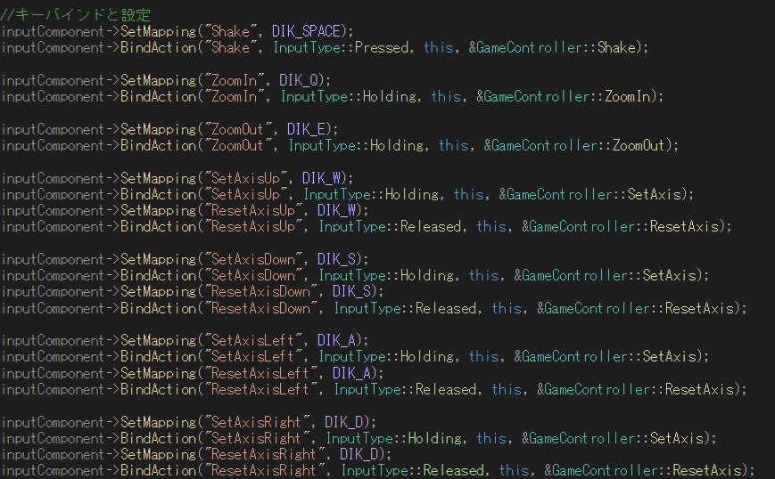
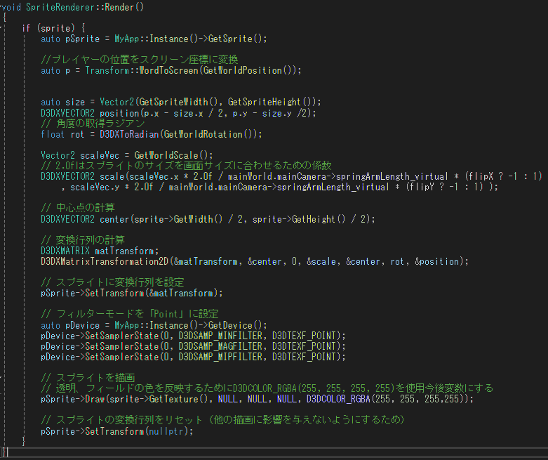

# 2Dエンジンライブラリ

**ソースコードのダウンロード**

<a href="https://github.com/Shatang0821/RunningUntiy/archive/refs/heads/main.zip" target="_blank">ここをクリック</a>

## 概要

**制作環境** : Directx9　VisualStudio2022

**制作人数** : 1人

**制作期間** : 2024.6.19~2024.8.2

**説明** : このライブラリを作成した目的は、既存のゲームエンジンの内部構造を理解し、C++のスキルを向上させるためです。自分自身でエンジンの基本機能を実装することで、ゲーム開発の基礎力を高めたいと思います

---

このライブラリは、簡単な2Dゲーム開発を支援するために設計されています。以下の機能を提供します：

## 機能
#### 目次
- [入力処理](#入力処理)
- [スプライト表示](#スプライト表示)
- [カメラ操作](#カメラ操作)

### 入力処理
    - キーボードやマウスの入力を簡単に取得し、ゲーム内での操作を実現します。
    -キーの押された状態、離された状態、押し続けられた状態ごとにアクションをバインドできるようにしています。

#### InputManager
エンジン側で自動で初期化と終了処理を行い、ユーザの入力を取得することができます
  <a href = "" target="_blank" rel="noopener noreferrer">InputManagersソースコード</a>
    
#### InputComponent
入力にアクションをバインドするためのコンポーネントとなり、使用者がSetMappingとBindActionを呼び出せば処理をバインドすることができます!    

  <a href = "" target="_blank" rel="noopener noreferrer">InputComponentソースコード</a>

### スプライト表示
    - 画像を読み込み、画面にスプライトを表示することができます。
    - スプライトの位置、回転、スケーリングをサポート。
    - スプライトシートおよび単一のスプライト画像の両方素材に対応。

#### 

#### SpriteRenderer
スプライト表示処理を行うクラス

オブジェクトの世界座標を基をスクリーン座標に変換してスケールと回転を基に表示する

### カメラ操作
    - ゲームの視点を操作するためのカメラ機能を提供。
    - カメラの移動やズームを通じて、ゲームの視点を動的に変更可能。
    - カメラシェークも提供しています

### 物理演算
    矩形および円形の当たり判定機能を備え、オブジェクト間の衝突を検出。
### オブジェクトの自動メモリ解放
    - ライブラリの基底クラスを継承すれば使用が終わったオブジェクトを自動的に解放する機能があり、メモリリークを防止。

